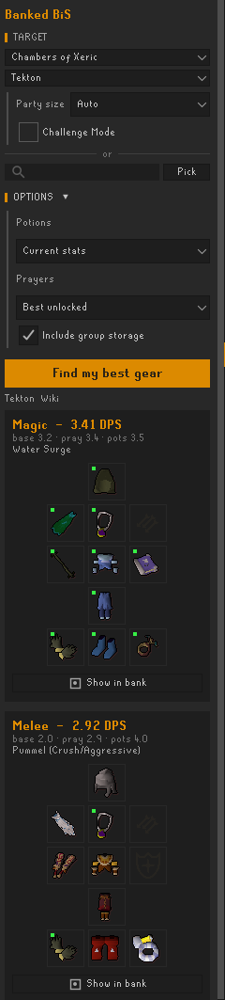
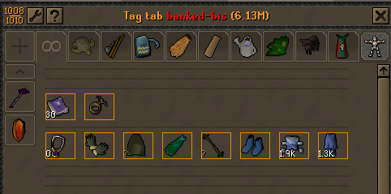

# Banked BiS

The best gear **you actually own**, for the content you're about to do.

Pick a boss (or search any monster), hit **Find my best gear**, and get the
highest-DPS setup per combat style from your bank, group storage, inventory,
and worn equipment - using the OSRS Wiki DPS calculator's formulas.

## Features

- Presets for raids, God Wars, Slayer, Wilderness, and more - or search every
  monster by name, or **Pick** one by clicking it in-game
- Raid options where they matter: CoX party size and Challenge Mode scale
  monster defence
- Potion and prayer options; Piety/Rigour/Augury unlocks detected automatically
- Slayer tasks read from the Slayer plugin, so slayer helm math just works
- Standard spellbook casting with elemental weaknesses
- **Show in bank** filters your open bank to the loadout (via Bank Tags)
- Opt-in party bank sharing: recommendations can include gear a group member
  could lend (item ids and quantities only, off by default)

## Usage

1. Open your bank once so the plugin knows what you own (and group storage,
   if you have one). It stays up to date from then on.
2. Pick a target, hit **Find my best gear**, grab your setup with
   **Show in bank**.

## Accuracy

Formulas match the wiki calc for melee, ranged, powered staves, and standard
elemental spells, including set effects (void, crystal, Inquisitor's) and
slayer/salve/demonbane/dragonhunter-style bonuses. Known gaps - double-check
the wiki calc for these: Ancients/Arceuus/god spells, the split ranged
defence types, flat armour, special attacks, and item charge states. ToA
invocations and ToB party size scale monster HP only, so they never change
gear ranking.

## Data & privacy

- DPS engine adapted from [LlemonDuck/dps-calculator](https://github.com/LlemonDuck/dps-calculator)
  (BSD-2, see `LICENSE-dps-calculator`)
- Equipment/monster stats from the wiki team's
  [weirdgloop/osrs-dps-calc](https://github.com/weirdgloop/osrs-dps-calc) data
- Ownership snapshots are stored locally under `.runelite/bank-bis/` and
  never leave your machine
